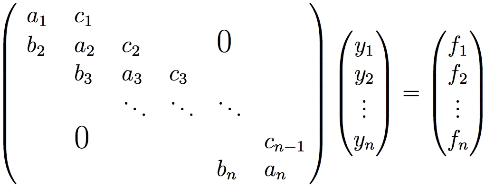

# Параллельные вычисления и алгоритмы
## Реализация на языке C++

1. [ Постановка задачи ](#task)
2. [ Теоретическое описание решения задачи ](#theory)
3. [ Описание архитектуры проекта ](#arch)
4. [ Сборка программы ](#compile)
5. [ Запуск программы ](#run)
6. [ MPI ](#MPI)
7. [ OpenMP ](#OpenMP)
8. [ Pthreads ](#pthreads)

<a name="task"></a>
### 1. Постановка задачи

1. Требуется реализовать алгоритм решения СЛАУ с ленточными матрицами, допускающий распараллеливание на несколько потоков/процессов.
2. Разработать тесты для проверки корректности алгоритма (входные данные, выходные данные, код для сравнения результатов). Для подготовки наборов тестов можно использовать математические пакеты, например, matlab (есть в классе СКЦ).
3. Реализовать алгоритмы с использованием следующих технологий:
    1. С++ & MPI
    2. С++ & OpenMP
    3. C++ & Linux pthreads
4. Провести исследование эффекта от использования многоядерности / многопоточности / многопроцессности на СКЦ

<a name="theory"></a>
### 2. Теоретическое описание решения задачи

Требуется реализовать алгоритм решения СЛАУ с ленточными матрицами, допускающий распараллеливание на несколько потоков/процессов.

СЛАУ с ленточными матрицами (трехдиагональными) представляет из себя систему уравнение с диагональным преобладанием в котором ненулевыми элементами являются только диагональные, поддиагональные и наддиагональные.



Пусть каждый поток обрабатывает m=n/p строк матрицы A (n\*n), т.е. k-ый поток обрабатывает строки с номерами 1+(k–1)\*m<= i<= k*m. Если число строк не кратно числу потоков, то поток с наибольшим порядковым номером будет обрабатывать большее число строк, чем остальные потоки. В пределах полосы матрицы можно организовать исключение поддиагональных элементов (прямой ходметода): вычитание строки i, умноженной на константу bi+1/ai, из строки i+1 с тем, чтобы результирующий коэффициент при неизвестной xi в (i+1)-ой строке оказался нулевым.

<a name="arch"></a>
### 3. Описание архитектуры проекта

В директории **data** находятся тестовые данные.

В директории **src** находятся исходный код на языке *C++*. Директория содержит подпапки **algorithm**, **MPI**, **openmp**, **pthread**. **src/alrohithm** содержит исходный код программы, реализующей последовательный последовательный алгоритм решения задачи. Остальные подпапки содержат реализацию алгоритма с помощью соответствующей технологии.

В директории **app** соержатся исполняемые файлы программы.

<a name="compile"></a>
### 4. Компиляция

Сборка программы возможна с помощью инструмента **make**.

Для того чтобы собрать программу, реализующую последоавтельный алгоритм:
```bash
$ make alg
```

Для того чтобы собрать программу, реализующую параллельный алгоритм с помощью MPI:
```bash
$ make MPI
```

Для того чтобы собрать программу, реализующую параллельный алгоритм с помощью OpenMP:
```bash
$ make openmp
```

Для того чтобы собрать программу, реализующую параллельный алгоритм с помощью pthreads:
```bash
$ make pthreads
```

<a name="run"></a>
### 5. Запуск

Исполняемые файлы собираются в директорию **app** и называются:
1. alg.out
2. MPIlab.out
3. OpenMPlab.out
4. pthreadslab.out

Пример запуска программы из корня проекта:
```bash
$ app/alg.out
```

<a name="MPI"></a>
### 6. MPI

<a name="OpenMP"></a>
### 7. OpenMP

<a name="pthreads"></a>
### 8. Pthreads