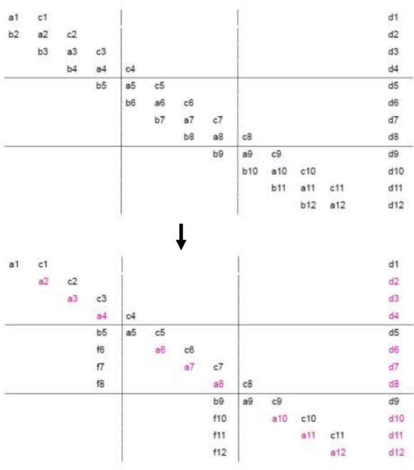
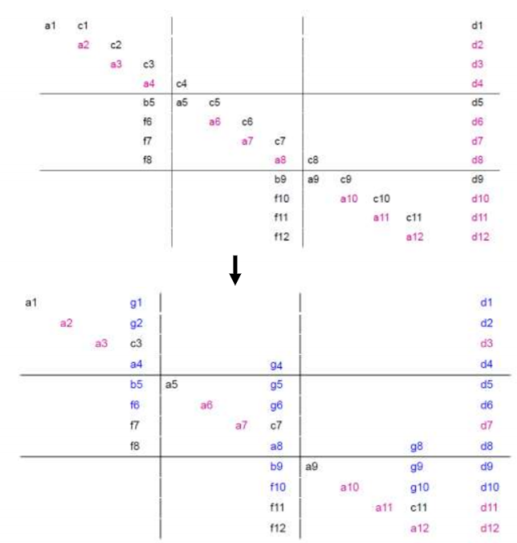

# Параллельные вычисления и алгоритмы
## Реализация на языке C++

1. [ Постановка задачи ](#task)
2. [ Теоретическое описание решения задачи ](#theory)
3. [ Описание архитектуры проекта ](#arch)
4. [ Сборка программы ](#compile)
5. [ Запуск программы ](#run)
6. [ MPI ](#MPI)
7. [ OpenMP ](#OpenMP)
8. [ Pthreads ](#pthreads)

<a name="task"></a>
### 1. Постановка задачи

1. Требуется реализовать алгоритм решения СЛАУ с ленточными матрицами, допускающий распараллеливание на несколько потоков/процессов.
2. Разработать тесты для проверки корректности алгоритма (входные данные, выходные данные, код для сравнения результатов). Для подготовки наборов тестов можно использовать математические пакеты, например, matlab (есть в классе СКЦ).
3. Реализовать алгоритмы с использованием следующих технологий:
    1. С++ & MPI
    2. С++ & OpenMP
    3. C++ & Linux pthreads
4. Провести исследование эффекта от использования многоядерности / многопоточности / многопроцессности на СКЦ

<a name="theory"></a>
### 2. Теоретическое описание решения задачи

Требуется реализовать алгоритм решения СЛАУ с ленточными матрицами, допускающий распараллеливание на несколько потоков/процессов.

СЛАУ с ленточными матрицами (трехдиагональными) представляет из себя систему уравнение с диагональным преобладанием в котором ненулевыми элементами являются только диагональные, поддиагональные и наддиагональные.


СЛАУ такого типа решаются с помощью метода прогонки (алгоритм Томаса). Последовательный метод не может быть распараллелен в чистом виде. Для того чтобы использовать параллельные вычисления используется измененная версия алгоритма, которая называется алгоритмом параллельной блочной прогонки. Идея метода заключается в том, чтобы СЛАУ на подматрицы (блоки) в количестве соответсвующем числу потоков. Ниже представлено более детальное описание алгоритма.

Пусть каждый поток обрабатывает **m=n/p** строк матрицы **A (n\*n)**, т.е. **k**-ый поток обрабатывает строки с номерами 

**1+(k–1)\*m<= i<= k\*m**
 
Если число строк не кратно числу потоков, то поток с наибольшим порядковым номером будет обрабатывать большее число строк, чем остальные потоки. В пределах полосы матрицы можно организовать исключение поддиагональных элементов (прямой ходметода): вычитание строки **i**, умноженной на **b_{i+1}/ai**, из строки **i+1** с тем, чтобы результирующий коэффициент при неизвестной **xi** в **(i+1)**-ой строке оказался нулевым.



Обращаю внимание на то, что зануление в первом блоке не приводит к порождению новых элементов (столбца **f**).

Далее происходит зануление наддиагональных элементов каждого блока: вычитание строки **i + 1**, умноженной на **сi/a_{i + 1)** из **i**-ой строки. Стоит отметить, что данный шаг отличается в различных работах, рассмотренных при выполнении лабораторной работы. В данной реализации элемент **c11** не зануляется, таким образом порожденные этим действием элементы **g** окажутся в том же столбце, что и **f**. В этом действии появляется проблема когерентности, так как изменяется граничный между блоками диагональный элемент. Проблема когерентности решается, например, обращением к общей памяти в критической секции. По-сути каждый поток начинает свою работу с предпоследнего элемента соответствующего блока и заканчивая последним элементом предыдущего потока.



Из полученного СЛАУ возьмем только последние строки каждого блока. Полученное СЛАУ выглядит следующим образом:


Данную систему можно решить последовательным методом прогонки, так как количество его строк соответствует числу потоков (это очень мало).

Таким образом мы определили элементы решения **x** на границах блоков. Далее, в каждом блоке с помощью одного прохода вычисляем остальные элементы **x**.

- Для 0-ого потока: 
  
    **x_{i} = ( d_{i} - g_{i}\*x_{последний в этом блоке} ) / a_{i}**

- Для других потоков:
 
    **x_{i} = ( d_{i} - g_{i}\*x_{последний в этом блоке} - f_{i}\*x_{последний в предыдущем блоке} ) / a_{i}**

В зависимости от реализации индексы и структура может отличаться. Например в приложенном коде потоки перед непосредственным нахождением **x** сожержали только свои элементы **a**, **d**, **f** и **g**. **g** при этом содержал элемнт **c** с которого начиналось зануление наддиагональных элементов и элемент **g** со строки предыдущего потока (за исключением нулевого потока). 

<a name="arch"></a>
### 3. Описание архитектуры проекта

В директории **data** находятся тестовые данные.

В директории **src** находятся исходный код на языке *C++*. Директория содержит подпапки **algorithm**, **MPI**, **openmp**, **pthread**, **tools**. **src/alrohithm** содержит исходный код программы, реализующей последовательный последовательный алгоритм решения задачи. Остальные подпапки содержат реализацию алгоритма с помощью соответствующей технологии.

В директории **app** соержатся исполняемые файлы программы.

<a name="compile"></a>
### 4. Компиляция

Сборка программы возможна с помощью инструмента **make**.

Для того чтобы собрать программу, реализующую последоавтельный алгоритм:
```bash
$ make alg
```

Для того чтобы собрать программу, реализующую параллельный алгоритм с помощью MPI:
```bash
$ make MPI
```

Для того чтобы собрать программу, реализующую параллельный алгоритм с помощью OpenMP:
```bash
$ make openmp
```

Для того чтобы собрать программу, реализующую параллельный алгоритм с помощью pthreads:
```bash
$ make pthreads
```

<a name="run"></a>
### 5. Запуск

Исполняемые файлы собираются в директорию **app** и называются:
1. alg.out
2. MPIlab.out
3. OpenMPlab.out
4. pthreadslab.out

Пример запуска программы из корня проекта:
```bash
$ app/alg.out
```

<a name="MPI"></a>
### 6. MPI

<a name="OpenMP"></a>
### 7. OpenMP

При реализации алгоритма были рассмотрены основные директивы omp. Параметр **for** не мог быть примененным по причине итерационно-зависимой структуры алгоритма.

Параметры **private** и **shared** так же были проигнорированны, потому что было отдано предпочтение объявлению локальных данных в scope-e директивы **#pragma omp parallel**, а общих переменны за scope-ом директивы. 

Количество потоков задается с помощью параметра **num_threads(threads_num)**. В параллельном scope-е каждый поток содержит копии необходимых ему частей диагональных, наддиагональных, поддиагональных массивов, а также массивов правой части уравнения и порождаемые им элементы **f** и **g**.

На этапах выполнения алгоритма, когда часть данных одного потока требуется для работы другому потоку была реальзованна конструкция критической секции для того, чтобы избежать одновременной записи в общие данные. Критическая секция реализуется с помощью директивы **#pragma omp critical**.

Для того, чтобы данные, требуемые одному потоку от другого были точно доступны к моменту обращения к ним была использована директива **#pragma barrier**, которая не позволяет потоку продолжать работу, пока остальные потоки не дошли до этой директивы.

На этапе вычисления граничных условий используется последовательный алгоритм метода прогонки, который возвращает данные, которые нужны всем потокам. Соответственно требовалось вычислять эту часть один раз, но все локальные переменные потока еще потребуются после этого, поэтому вариант с прерыванием параллельного scope-а отпадает. Для этого была использована директива **#pragma omp single**, которая запускает свой scope только на одном потоке.


<a name="pthreads"></a>
### 8. Pthreads