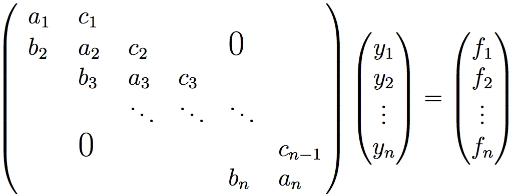
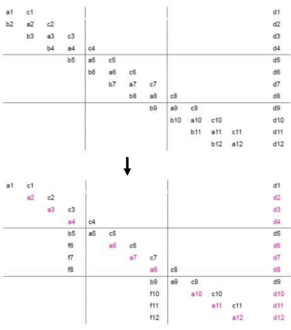
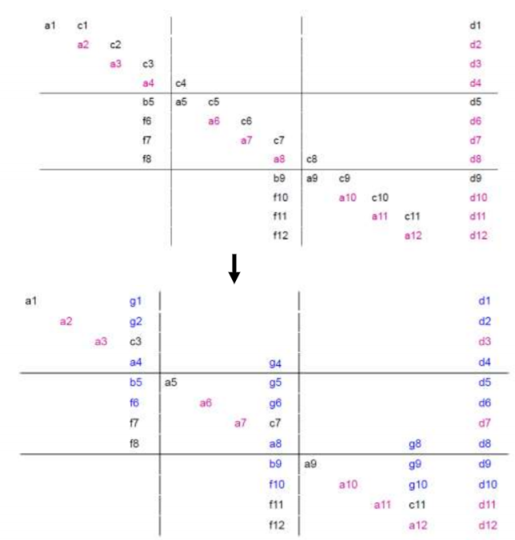
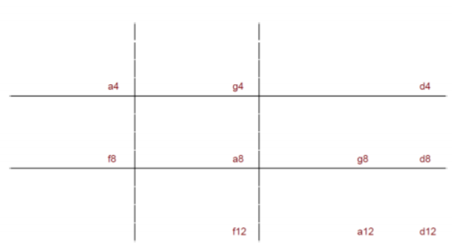
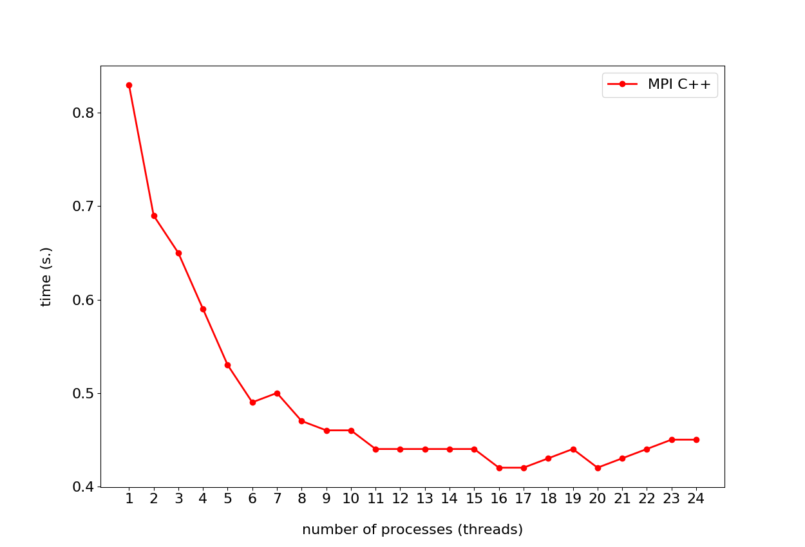
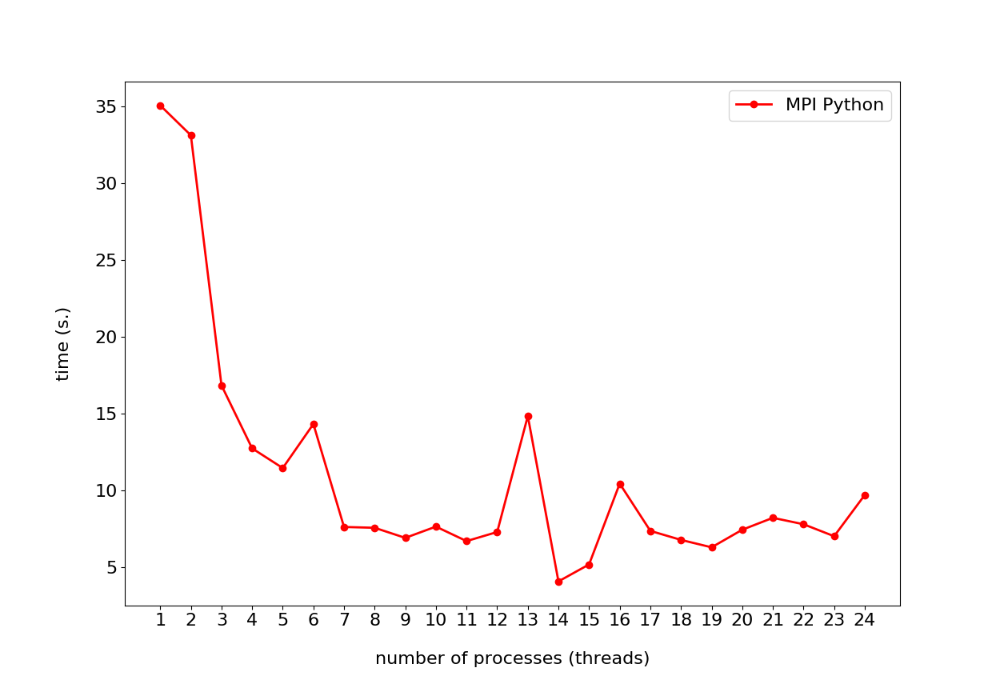
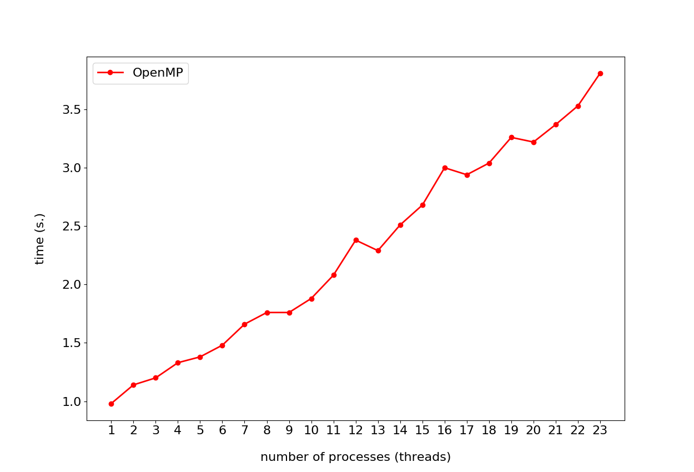
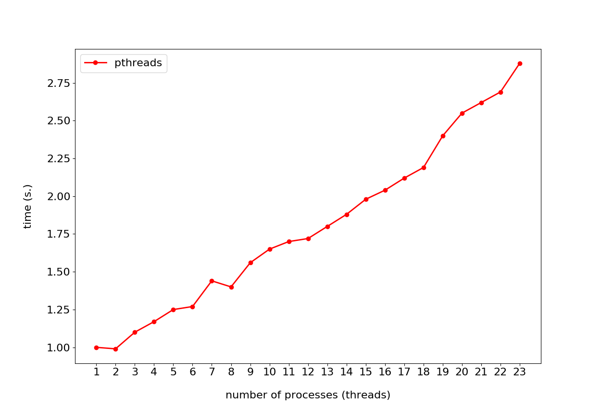

# Параллельные вычисления и алгоритмы
## Реализация на языке C++

1. [ Постановка задачи ](#task)
2. [ Теоретическое описание решения задачи ](#theory)
3. [ Описание архитектуры проекта ](#arch)
4. [ Сборка программ на языке С++ ](#compile)
5. [ Запуск программ ](#run)
6. [ MPI ](#MPI)
7. [ OpenMP ](#OpenMP)
8. [ Pthreads ](#pthreads)
9. [ Результаты и исследование ](#research)

<a name="task"></a>
### 1. Постановка задачи

1. Требуется реализовать алгоритм решения СЛАУ с ленточными матрицами, допускающий распараллеливание на несколько потоков/процессов.
2. Разработать тесты для проверки корректности алгоритма (входные данные, выходные данные, код для сравнения результатов). Для подготовки наборов тестов можно использовать математические пакеты, например, matlab (есть в классе СКЦ).
3. Реализовать алгоритмы с использованием следующих технологий:
    1. С++ & MPI
    2. С++ & OpenMP
    3. C++ & Linux pthreads
4. Провести исследование эффекта от использования многоядерности / многопоточности / многопроцессности на СКЦ

<a name="theory"></a>
### 2. Теоретическое описание решения задачи

Требуется реализовать алгоритм решения СЛАУ с ленточными матрицами, допускающий распараллеливание на несколько потоков/процессов.

СЛАУ с ленточными матрицами (трехдиагональными) представляет из себя систему уравнение с диагональным преобладанием в котором ненулевыми элементами являются только диагональные, поддиагональные и наддиагональные.



СЛАУ такого типа решаются с помощью метода прогонки (алгоритм Томаса). Последовательный метод не может быть распараллелен в чистом виде. Для того чтобы использовать параллельные вычисления используется измененная версия алгоритма, которая называется алгоритмом параллельной блочной прогонки. Идея метода заключается в том, чтобы СЛАУ на подматрицы (блоки) в количестве соответсвующем числу потоков. Ниже представлено более детальное описание алгоритма.

Пусть каждый поток обрабатывает **m=n/p** строк матрицы **A (n\*n)**, т.е. **k**-ый поток обрабатывает строки с номерами

**1+(k–1)\*m<= i<= k\*m**

Если число строк не кратно числу потоков, то поток с наибольшим порядковым номером будет обрабатывать большее число строк, чем остальные потоки. В пределах полосы матрицы можно организовать исключение поддиагональных элементов (прямой ходметода): вычитание строки **i**, умноженной на **b_{i+1}/ai**, из строки **i+1** с тем, чтобы результирующий коэффициент при неизвестной **xi** в **(i+1)**-ой строке оказался нулевым.



Обращаю внимание на то, что зануление в первом блоке не приводит к порождению новых элементов (столбца **f**).

Далее происходит зануление наддиагональных элементов каждого блока: вычитание строки **i + 1**, умноженной на **сi/a_{i + 1)** из **i**-ой строки. Стоит отметить, что данный шаг отличается в различных работах, рассмотренных при выполнении лабораторной работы. В данной реализации элемент **c11** не зануляется, таким образом порожденные этим действием элементы **g** окажутся в том же столбце, что и **f**. В этом действии появляется проблема когерентности, так как изменяется граничный между блоками диагональный элемент. Проблема когерентности решается, например, обращением к общей памяти в критической секции. По-сути каждый поток начинает свою работу с предпоследнего элемента соответствующего блока и заканчивая последним элементом предыдущего потока.



Из полученного СЛАУ возьмем только последние строки каждого блока. Полученное СЛАУ выглядит следующим образом:



Данную систему можно решить последовательным методом прогонки, так как количество его строк соответствует числу потоков (это очень мало).

Таким образом мы определили элементы решения **x** на границах блоков. Далее, в каждом блоке с помощью одного прохода вычисляем остальные элементы **x**.

- Для 0-ого потока:

    **x_{i} = ( d_{i} - g_{i}\*x_{последний в этом блоке} ) / a_{i}**

- Для других потоков:

    **x_{i} = ( d_{i} - g_{i}\*x_{последний в этом блоке} - f_{i}\*x_{последний в предыдущем блоке} ) / a_{i}**

В зависимости от реализации индексы и структура может отличаться. Например в приложенном коде потоки перед непосредственным нахождением **x** сожержали только свои элементы **a**, **d**, **f** и **g**. **g** при этом содержал элемнт **c** с которого начиналось зануление наддиагональных элементов и элемент **g** со строки предыдущего потока (за исключением нулевого потока).

<a name="arch"></a>
### 3. Описание архитектуры проекта

В директории **source** содержится непосредственно проект лабораторных программ.

Директория **data** содержит данные с которыми работают программы (как входные, так и выходные).

В директории **src** находятся исходный код на языках *C++*, *Python3*, а также скрипты на языке *bash* для тестирования *MPI*. Директория содержит подпапки **algorithm**, **MPI**, **openmp**, **pthread**, **tools**, **python**. **src/alrohithm** содержит исходный код программы, реализующей последовательный последовательный алгоритм решения задачи. Остальные подпапки содержат реализацию алгоритма с помощью соответствующей технологии и языка (директория **python** - это *MPI + Python*).

В проекте реализован *Makefile*, команды которого приведены ниже.

В директории **app** соержатся исполняемые файлы программ на языке *C++*.

<a name="compile"></a>
### 4. Компиляция

Сборка программы возможна с помощью инструмента **make**.

Для того чтобы собрать программу, реализующую последоавтельный алгоритм:
```bash
$ make alg
```

Для того чтобы собрать программу, реализующую параллельный алгоритм с помощью MPI:
```bash
$ make MPI
```

Для того чтобы собрать программу, реализующую параллельный алгоритм с помощью OpenMP:
```bash
$ make openmp
```

Для того чтобы собрать программу, реализующую параллельный алгоритм с помощью pthreads:
```bash
$ make pthreads
```

<a name="run"></a>
### 5. Запуск

Исполняемые файлы на языке *С++* собираются в директорию **app** и называются:
1. alg.out
2. MPIlab.out
3. OpenMPlab.out
4. pthreadslab.out

Пример запуска программы из корня проекта:
```bash
$ app/alg.out
```

Для удобства тестирования программ, использующих технологию *MPI* (неудобство тестирования в данном случае затруднено самой идеалогии технологии) реализованы задачи для **make**:

```bash
$ make MPIrunCompare
$ make MPIPyrunCompare
```

Обе указанные команды запускают скрипт на языке *bash*, создающий необходимые файлы для тестирования и запускающий программы с разным количеством процессов.

<a name="MPI"></a>
### 6. MPI

Использование технологии для данной задачи было реализовано на двух языках: *С++* и *Python3*. Синтаксис в общем и целом схожий, однако на языке *Python* команды немного проще для восприятия по причине отсутствия непосредственной работы с адресным пространством.

Технология, что весьма важно, основана на парадигме, использующей процессы для распараллеливания кода, т.е., грубо говоря, каждая "копия" кода запускается на отдельном процессе, а взаимодействие между процессами реализовано с помощью отправки строго типизированных сообщений от процесса к процессу.

При реализации решения задачи были использованы следующие конструкции MPI: Send, Recv, Bcast, Allgather, Gatherv, Barrier.

**Send** и **Recv**, осуществляющие отправку и прием сообщений процессами, были использованы при подсчете граничных условий, когда требовалось посчитать их на одном процессе, а от всех остальных получить необходимые данные для подсчета.

**Bcast** отправляет значение переменной с одного процесса и присваивает его этой же переменной в других процессах.  Использовалась для непосредственной синхронизации значений переменных (как длины 1, так и массивов), которые подсчитываются на одном процессе, однако требуются для вычислений всем. Например, такие данные это результаты вычислений граничных условий. Также часто использовалась в сочетании с  **Gatherv** для объединения результатов подсчитанных на каждом процессе отдельно и получения объединенных результатов для всех процессов.

**Allgather** объединяет значения переменной с разных процессов в один массив и этот массив доступен для всех процессов. Использовалась исключительно для подсчетов параметров для использования конструкции **Gatherv**.

**Gatherv** объединяет вектора разного размера в один. Использовалась только для обновления значений "глобальных" массивов.

Компиляция программы на языке *C++* осуществляется с помощью компилятора **mpic++**. Аргументы и взаимодействие с компиляторам аналогичны **gcc**.

Запуск программы соответственно осуществляется с помощью специальной команды **mpiexec** в аргументах которой указывается количество используемых процессов и другие опциональные аргументы, один из которых - **python3**, данный аргумент запускает скрипт на языке python для которого необходимо использовать технологию.

Так же стоит отметить, что общение происходит через коммуникатор *MPI_COMM_WORLD*.

<a name="OpenMP"></a>
### 7. OpenMP

При реализации алгоритма были рассмотрены основные директивы omp. Параметр **for** не мог быть примененным по причине итерационно-зависимой структуры алгоритма.

Параметры **private** и **shared** так же были проигнорированны, потому что было отдано предпочтение объявлению локальных данных в scope-e директивы **#pragma omp parallel**, а общих переменны за scope-ом директивы.

Количество потоков задается с помощью параметра **num_threads(threads_num)**. В параллельном scope-е каждый поток содержит копии необходимых ему частей диагональных, наддиагональных, поддиагональных массивов, а также массивов правой части уравнения и порождаемые им элементы **f** и **g**.

На этапах выполнения алгоритма, когда часть данных одного потока требуется для работы другому потоку была реальзованна конструкция критической секции для того, чтобы избежать одновременной записи в общие данные. Критическая секция реализуется с помощью директивы **#pragma omp critical**.

Для того, чтобы данные, требуемые одному потоку от другого были точно доступны к моменту обращения к ним была использована директива **#pragma barrier**, которая не позволяет потоку продолжать работу, пока остальные потоки не дошли до этой директивы.

На этапе вычисления граничных условий используется последовательный алгоритм метода прогонки, который возвращает данные, которые нужны всем потокам. Соответственно требовалось вычислять эту часть один раз, но все локальные переменные потока еще потребуются после этого, поэтому вариант с прерыванием параллельного scope-а отпадает. Для этого была использована директива **#pragma omp single**, которая запускает свой scope только на одном потоке.


<a name="pthreads"></a>
### 8. Pthreads

Имеют похожий синтаксис с OpenMP, так как обе технологии основанны на парадигме использования потоков.

Для реализации критических секций используется **mutex**. Это объект типа *pthread_mutex_t*, который работает по принципу "свободно/занято". Когда поток заходит в критическую часть кода - он устанавливает **mutex** в заблокированное положение с помощью конструкции *pthread_mutex_lock*, а когда он покидает эту часть кода устанавливает **mutex** в открытое положение с помощью конструкции *pthread_mutex_unlock*. Стоит отметить, что объекты **mutex** желательно не переиспользовать - это может привести к непредсказуемым результатам.

Для синхронизации потоков используется **Barrier**. Это объект типа *pthread_barrier_t*, который при инициализации находится в "заблокированном" состоянии, но когда все потоки дойдут до части кода, где требовалась синхронизация - объект принимает "разблокированное" состояние и работа всех потоков может быть продолжена. Место кода, где требуется синхронизация помечается с помощью конструкции *pthread_barrier_wait(&barrier)*, где *&barrier* это ссылка на объект типа *pthread_barrier_t*. Объект может быть переиспользован.

<a name="research"></a>
### 9. Результаты и исследование

Ниже представлены графики зависимости времени вычислений от количества процессов для технологии **MPI**.





Как можно заметить ускорение наблюдается для обоих случаев, однако требуется отметить, что время работы скрипта на языке **Python** почти на два порядка больше. Это скорее относится не к самой технологии, а к уровню языков. *C++* значительно более низкоуровневый, соответственно получаемый код может оказаться более оптимизированный при меньших затратах и современные компиляторы для *C++* помогают в этом.

Ниже представлены графики зависимости времени вычислений от количества процессов для технологий **OpenMP** и **pthreads**.





К сожалению добиться хорошего результата не получилось. Были проведены все проверки на количество задействованных потоков и было сделано предположение, что проблема непосредственно в самой реализации синхронизации между потоками. Так как это происходило поэлементным копированием данных в отличии от **MPI**, где работа шла в основном с адресным пространством. Наверняка результат можно улучшить, однако это является слишком трудозатратным в условиях поставленной задачи и полученные выводы также имеют ценность. Ранее автором уже проводились работы с **OpenMP** и в случаях распараллеливания программ для решения задач с независимыми переменными данные технологии показывают очень хороший результат при низкой трудозатратности в написании кода.

Добавляя к выше сказанному - решение задачи достаточно элегантно сочетается с конструкциями **MPI** и если в случае с **OpenMP** и **pthreads** параллельный алгоритм не претерпевал изменений под технологии, то в случае с **MPI** это происходило. В этом есть свои преимущества и недостатки. К преимуществам можно отнести хорошую производительность, а к недостаткам сложность написания кода, ведь пришлось переосмыслить реализацию параллельного алгоритма.

В общем и целом, технологии применимы в разных классах задачах и для достижения разных целей.

Полные таблицы замеров времени на кластере СКЦ СПбПУ находятся в директории **HCresults/run1**.